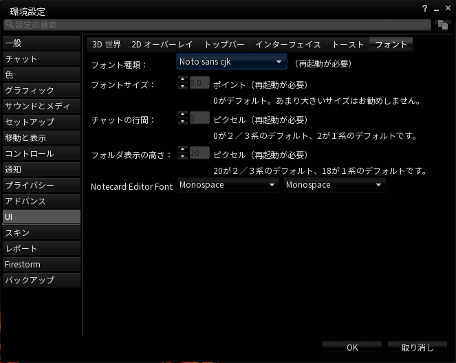
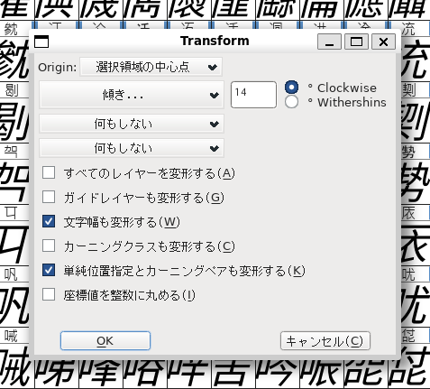
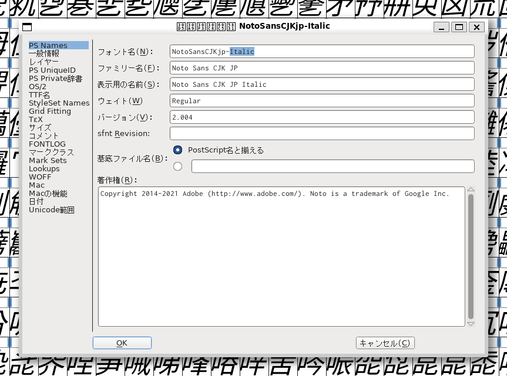

# Noto Sans CJK for Firestorm

これは、SecondLife 向けサードパーティー製ビューアーの [Firestorm Viewer](https://www.firestormviewer.org/) の Noto フォントを日本語などの漢字が含まれる [Noto Sans CJK](https://github.com/notofonts/noto-cjk) および、[源ノ角ゴシック](https://github.com/adobe-fonts/source-han-sans)に差し替えて、[Alchemy Viewer](https://alchemyviewer.org/) 相当のフォント設定に変更する定義ファイルです。

現在の設定では OS のフォントを使用しているため、環境によって書体やサイズが変わったり読みづらくなる原因になっていました。このパッチを使用することで、日中韓のフォントがすべて Noto フォント系で統一されます。

## インストール

このリポジトリの以下のファイルを、Firestorm の`fonts`ディレクトリ（Windows の場合`C:\Program Files\Firestorm-Releasex64\fonts`）に入れてください。

- fonts_noto_sans_cjk.xml
- NotoSans-Regular.ttf
- NotoSansCJK-Bold.otf
- NotoSansCJK-Regular.otf
- NotoSansMath-Regular.otf
- NotoSansSymbols-Bold.ttf
- NotoSansSymbols-Regular.ttf
- NotoSansSymbols2-Regular.ttf
- SourceHanSans-Regular.otf

次に Firestorm を起動し、UI のフォント設定から`Noto sans cjk`を選ぶだけです。

## 変更するフォント

このリポジトリでは、デフォルトのフォントに[Noto Sans CJK](https://github.com/notofonts/noto-cjk) 系を採用しています。
Monospace フォントの指定が、Noto Sans Mono でなく、[源ノ角ゴシック](https://github.com/adobe-fonts/source-han-sans)を採用している理由は、Noto Sans Mono は、全角文字１文字に対して半角２文字でないため、インデントが崩れるためです。

| オリジナルのフォント名       | 変更後のフォント名                    | 自分で作る |
| ---------------------------- | ------------------------------------- | ---------- |
| NotoMono-Regular.ttf         | NotoSansMonoCJKjp-Regular.otf         |
| NotoSans-Bold.ttf            | NotoSansCJKjp-Bold.otf                |
| NotoSans-BoldItalic.ttf      | ~~NotoSansCJKjp-BoldItalic.ttf~~      | ✓          |
| NotoSansCombined-Regular.ttf | ~~NotoSansCJKjpCombined-Regular.ttf~~ | ✓          |
| NotoSans-Italic.ttf          | ~~NotoSansCJKjp-Italic.ttf~~          | ✓          |
| SourceCodePro-Regular.ttf    | SourceHanSansHW-Regular.otf           |

## ~~不足しているフォント生成手順書~~

以下は読まなくていいです。

必要なもの：

- [Noto Sans](https://fonts.google.com/noto/specimen/Noto+Sans)
  - NotoSans-Bold.ttf
  - NotoSans-BoldItalic.ttf
- [Noto Sans Mono](https://fonts.google.com/noto/specimen/Noto+Sans+Mono)
  - NotoMono-Regular.ttf
- [Noto Emoji](https://fonts.google.com/noto/specimen/Noto+Sans+Emoji)
  - NotoEmoji-Regular.ttf
- [Language Specific OTFs](https://github.com/notofonts/noto-cjk/releases)
  - NotoSansCJK-Bold.otf
  - NotoSansCJK-Regular.otf
  - NotoSansMonoCJK-Regular.otf

### ~~下準備~~

まず、[Noto Sans CJK のリリースページ](https://github.com/notofonts/noto-cjk/releases)から最新版の Language Specific OTFs Japanese と、Language Specific Monospace OTFs Japanese をダウンロードします。サブセットフォントを選ばない理由は、SecondLife では日本人以外の漢字圏の言語を使用するプレイヤーもいるためです。

### ~~NotoSansMonoCJKjpCombined-Regular の作成~~

Firestorm では、`U+2714, HEAVY CHECK MARK`（✔）と、`BLACK RIGHT-POINTING TRIANGLE`（▶）を使用するため、NotoSans-Regular.ttf と [NotoSansSymbols-Regular.ttf](https://fonts.google.com/noto/specimen/Noto+Sans+Symbols) を結合したフォントを使用しています。このうち、▶ は Noto Sans CJK に含まれるので、コピーするのは ✔ だけです。現在の NotoSansSymbols-Regular.ttf には、✔ が含まれないので、[Noto Emoji](https://fonts.google.com/noto/specimen/Noto+Sans+Emoji)からコピーしましょう。

まず、NotoSansCJKjp-Regular.otf を複製して NotoSansMonoCJKjpCombined-Regular.otf にして FontForge で開きます。

次に FontForge の開くメニューで、NotoSansSymbols-Regular.otf を開いて ✔ を選択し、NotoSansMonoCJKjpCombined-Regular.otf にコピーして「フォント出力」で保存します。

なお、この書体はイタリックやボールド用を作る必要はありません。

### ~~イタリックフォントの生成作業~~

TODO: FontForge がクラッシュするので未実装

Noto Sans CJK に限らずアジア圏のフォントにはイタリックフォントが含まれていません。よく、Web サイトで`<i>`タグでくくられた箇所の日本語部分が反映されないのはこのためです。Second Life で斜体が漢字に反映されないのもこれが原因です。対象フォントは以下です。

- NotoSansCJKjp-Bold.otf
- NotoSansCJKjp-Regular.otf

まず、FontForge でこれを開いたあと、すべてを選択して「エレメント」メニューから「変形」を選択し、「Origin」の下のポップアップメニューから「傾き…」を選択したら、隣のフォームに 14 と入力し、°Clockwise のラジオボタンを押して OK ボタンを押します。

また、念のためフォント名も書き換えましょう。

これにより、クライアント内でも漢字や平仮名、ハングルでもイタリックが反映されるようになります。

なお、イタリック体は、アジア圏では**14° 傾けたフォント**として定義されていますが、**厳密には斜体とイタリックは異なります**。

## ライセンス

&copy; 2023 by Logue, Licensed under the GNU LESSER GENERAL PUBLIC LICENSE.

- [Noto Sans CJK and Mono License](./NotoSans-LICENSE.txt)
- [Source Hans Sans License](./SourceHanSans-LICENSE.txt)
