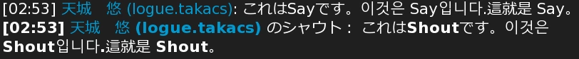
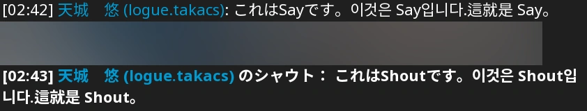
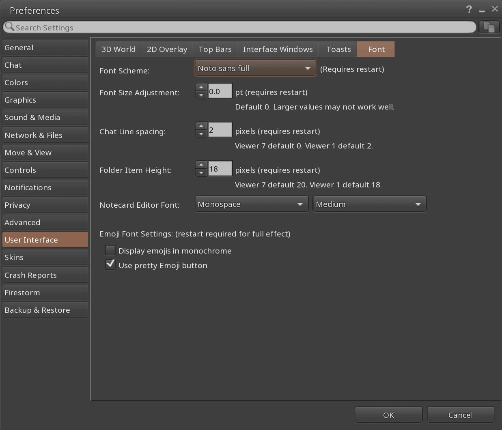

# Noto Sans Full for Firestorm and Aperture Viewer

This is a definition file that changes the Noto font of [Firestorm Viewer](https://www.firestormviewer.org/) and [Aperture Viewer](https://github.com/ApertureViewer/Aperture-Viewer), a third-party viewer for SecondLife, from [Noto Sans CJK](https://github.com/notofonts/noto-cjk) etc., which contains kanji characters such as Japanese, to the font settings equivalent to [Alchemy Viewer](https://alchemyviewer.org/).

Before:

After:

The current settings use the OS font, which causes the typeface and size to change depending on the environment, making it difficult to read. By using this patch, fonts for all languages ​​will be unified to the Noto font family.

## Install

[Download this repository](https://github.com/logue/firestorm-noto-sans-cjk/archive/refs/heads/master.zip).

Add the following files from this repository to your Firestorm `fonts` directory (`C:\Program Files\Firestorm-Releasex64\fonts` on Windows):

- fonts_noto_sans_full.xml
- NotoNaskhArabicUI-Bold.ttf
- NotoNaskhArabicUI-Regular.ttf
- NotoSans-Bold.ttf
- NotoSans-BoldItalic.ttf
- NotoSans-Italic.ttf
- NotoSans-Regular.ttf
- NotoSansCJK-Bold.ttc
- NotoSansCJK-Regular.ttc
- NotoSansDevanagariUI-Bold.ttf
- NotoSansDevanagariUI-Regular.ttf
- NotoSansEgyptianHieroglyphs-Regular.ttf
- NotoSans-Italic.ttf
- NotoSansKannadaUI-Bold.ttf
- NotoSansKannadaUI-Regular.ttf
- NotoSansMath-Regular.ttf
- NotoSansMono-Regular.ttf
- NotoSansOriya-Bold.ttf
- NotoSansOriya-Regular.ttf
- NotoSans-Regular.ttf
- NotoSansSymbols-Bold.ttf
- NotoSansSymbols-Regular.ttf
- NotoSansSymbols2-Regular.ttf
- NotoSansTamilUI-Bold.ttf
- NotoSansTamilUI-Regular.ttf
- NotoSansThai-Bold.ttf
- NotoSansThai-Regular.ttf

Next, start Firestorm and select `Noto sans full` from the UI font settings and set Font Adjustment to -1.0.

## See Also

- [Firestorm IBM Plex](https://github.com/logue/firestorm-ibm-plex) - Instead of Noto Sans, it uses IBM Plex fonts. Supports Chinese, Japanese, Korean, Thai, Arabic, Hebrew, etc.

## License

&copy; 2023,2025 by Logue, Licensed under the GNU LESSER GENERAL PUBLIC LICENSE.

- [Noto Sans CJK and Mono License](./NotoSans-LICENSE.txt)
