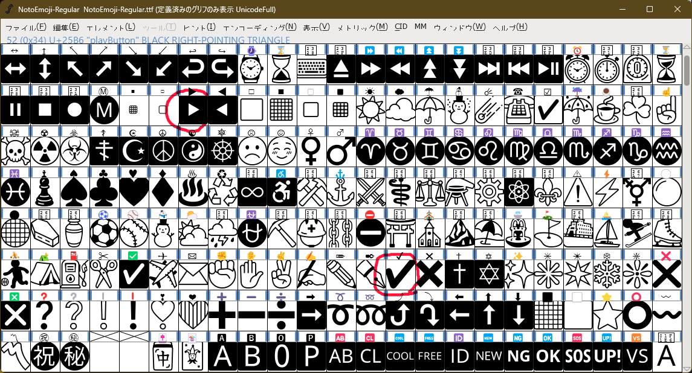

# Noto Sans CJKjp for Firestorm

これは、SecondLife 向けサードパーティー製ビューアーの [Firestorm Viewer](https://www.firestormviewer.org/) の Noto フォントを日本語などの漢字が含まれる [Noto Sans CJK](https://github.com/notofonts/noto-cjk) および、[源ノ角ゴシック](https://github.com/adobe-fonts/source-han-sans)に差し替えるパッチです。

## インストール

このリポジトリの以下のファイルを、Firestorm の`fonts`ディレクトリ（Windows の場合`C:\Program Files\Firestorm-Releasex64\fonts`）に入れてください。

- fonts_noto_sans_cjk.xml
- NotoSansCJKjp-Bold.otf
- NotoSansCJKjp-Regular.otf
- NotoSansMonoCJKjp-Regular.otf
- SourceHanSans-Regular.otf

次に Firestorm を起動し、UI のフォント設定から`Noto sans cjk`を選ぶだけです。

## 変更するフォント

このリポジトリでは、Noto Sans CJKjp （ソースコード部分は源ノ角ゴシック）を採用しています。

| オリジナルのフォント名       | 変更後のフォント名                    | 自分で作る |
| ---------------------------- | ------------------------------------- | ---------- |
| NotoMono-Regular.ttf         | NotoSansMonoCJKjp-Regular.otf         |
| NotoSans-Bold.ttf            | NotoSansCJKjp-Bold.otf                |
| NotoSans-BoldItalic.ttf      | ~~NotoSansCJKjp-BoldItalic.ttf~~      | ✓          |
| NotoSansCombined-Regular.ttf | ~~NotoSansCJKjpCombined-Regular.ttf~~ | ✓          |
| NotoSans-Italic.ttf          | ~~NotoSansCJKjp-Italic.ttf~~          | ✓          |
| SourceCodePro-Regular.ttf    | SourceHanSansHW-Regular.otf           |

## 下準備

以下は読まなくていいです。

必要なもの：

- [Noto Sans](https://fonts.google.com/noto/specimen/Noto+Sans)
  - NotoSans-Bold.ttf
  - NotoSans-BoldItalic.ttf
- [Noto Sans Mono](https://fonts.google.com/noto/specimen/Noto+Sans+Mono)
  - NotoMono-Regular.ttf
- [Noto Emoji](https://fonts.google.com/noto/specimen/Noto+Sans+Emoji)
  - NotoEmoji-Regular.ttf
- [Language Specific OTFs](https://github.com/notofonts/noto-cjk/releases)
  - NotoSansCJKjp-Bold.otf
  - NotoSansCJKjp-Regular.otf
  - NotoSansMonoCJKjp-Regular.otf

## 手順書

まず、[Noto Sans CJK のリリースページ](https://github.com/notofonts/noto-cjk/releases)から最新版の Language Specific OTFs Japanese と、Language Specific Monospace OTFs Japanese をダウンロードします。サブセットを選ばない理由は、SecondLife では日本人以外の漢字圏の言語を使用するプレイヤーもいるためです。

### ~~NotoSansMonoCJKjpCombined-Regular の作成~~

SecondLife では、`U+2714, HEAVY CHECK MARK`（✔）と、`BLACK RIGHT-POINTING TRIANGLE`（▶）を使用するため、NotoSans-Regular.ttf と [NotoSansSymbols-Regular.ttf](https://fonts.google.com/noto/specimen/Noto+Sans+Symbols) を結合したフォントを使用しています。このうち、▶ は Noto Sans CJKjp に含まれるので、コピーするのは ✔ だけです。現在の NotoSansSymbols-Regular.ttf には、✔ が含まれないので、[Noto Emoji](https://fonts.google.com/noto/specimen/Noto+Sans+Emoji)からコピーしましょう。

まず、NotoSansCJKjp-Regular.otf を複製して NotoSansMonoCJKjpCombined-Regular.otf にして FontForge で開きます。

次に FontForge の開くメニューで、NotoSansSymbols-Regular.otf を開いて ✔ を選択し、NotoSansMonoCJKjpCombined-Regular.otf にコピーして「フォント出力」で保存します。

なお、この書体はイタリックやボールド用を作る必要はありません。

### ~~イタリックフォントの生成作業~~

TODO: FontForge がクラッシュするので未実装

Noto Sans CJK に限らずアジア圏のフォントにはイタリックフォントが含まれていません。よく、Web サイトで`<i>`タグでくくられた箇所の日本語部分が反映されないのはこのためです。Second Life で斜体が漢字に反映されないのもこれが原因です。対象フォントは以下です。

- NotoSansCJKjp-Bold.otf
- NotoSansCJKjp-Regular.otf

まず、FontForge でこれを開いたあと、すべてを選択して「エレメント」メニューから「変形」を選択し、「Origin」の下のポップアップメニューから「傾き…」を選択したら、隣のフォームに 14 と入力し、°Clockwise のラジオボタンを押して OK ボタンを押します。

また、念のためフォント名も書き換えましょう。

これにより、クライアント内でも漢字や平仮名、ハングルでもイタリックが反映されるようになります。

なお、イタリック体は、アジア圏では **14° 傾けたフォント**として定義されていますが、厳密には斜体とイタリックは異なります。

## ライセンス

&copy; 2023 by Logue, Licensed under the MIT License.

- [Noto Sans CJK and Mono License](./NotoSans-LICENSE.txt)
- [Source Hans Sans License](./SourceHanSans-LICENSE.txt)
